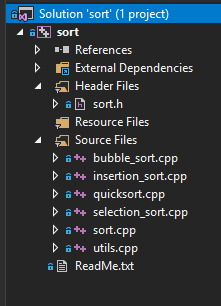
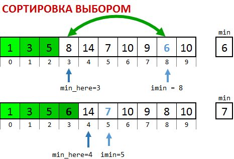
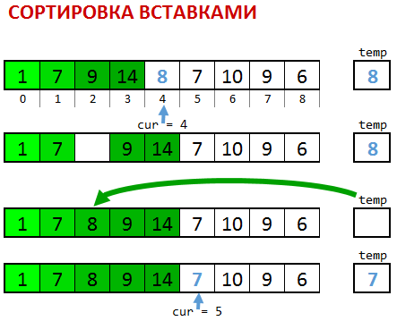
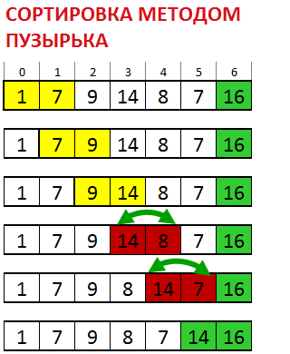

**Лабораторная работа № 6**


## Алгоритмы сортировки

**По этой лабораторной работе нужно сдать отчет в виде README.md в корне репозитория.**

Это файл в широко используемом формате разметки Markdown. В качестве образца можно взять этот README файл в папке `lab`.

Цель работы - изучить алгоритмы сортировки. Для этого у нас в репозитории готов проект, в котором реализованы некоторые из них.

Откройте папку репозитория в Проводнике и откройте sort.sln: \


Проект разделен на части, так что каждая функция сортировки находится в отдельном файле с соответствующим именем, а файл [`utils.cpp`](../sort/utils.cpp) содержит функции `swap` и `print`. Заголовочный файл [`sort.h`](../sort/sort.h) содержит объявления всех функций, чтобы их можно было использовать в главной функции main() в [`sort.cpp`](../sort/sort.cpp).\


О сортировке пузырьком и вставками можно посмотреть следующее [видео из курса CS50](https://www.youtube.com/watch?v=D1u3H9_wmUU). Забавные иллюстрации к алгоритмам сортировки (и не только) можно посмотреть на канале
[AlgoRythmics](https://www.youtube.com/user/AlgoRythmics/videos)



Функция `selection_sort`выбирает минимальный элемент среди неупорядоченных (на рисунке белые) и присоединяет его в конец упорядоченной части (на рисунке зеленые). Поэтому за первый проход алгоритма минимум массива ставится на первое место, за второй проход - второй по величине элемент ставится на второе место и т.д. Упорядоченная часть растет, не­упо­ря­до­ченная уменьшается по одному элементу за проход. Всего требуется N-1 проходов.


### Скопируйте список с заданиями в файл README.md в корне репозитория и вставляйте требуемые данные


1. Сперва мы сортируем один массив с фиксированными значениями. **Добавьте печать отсортированного массива после сортировки. Добавьте в код печать вашей фамилии.** Запустите программу и **вставьте скриншот** ее работы, на котором видна фамилия, сюда (в README.md в корне репозитория):\
 \
**Закомитьте исправления в коде, README.md, а также файл скриншота.**

2. Как выглядит массив после, например, третьего прохода? Откройте файл `selection_sort.cpp` и прочитайте комментарии. Индекс `min_here` показывает, куда сейчас надо ставить минимум. Нас интересует завершение прохода для `min_here`=2. **Вставьте соответствующий `if` с вызовом функции `print`в функцию `selection_sort`.**\
Запустите программу и **вставьте сюда скриншот** работы ОДНОГО запуска программы, на котором видна ваша фамилия и состояние массива РОВНО в три момента времени: 1) в начале, 2) после третьего прохода сортировки выбором, 3) после окончания сортировки:
 \
**Закомитьте исправления в коде, README.md, а также файл новый файл скриншота.**

3. Давайте вставим подсчет количества операций в функцию `selection_sort`. Будем считать наиболее часто повторяющиеся операции. В функции есть переменная `ops`.  \
**А.** Добавьте : 
- ее обнуление в начало программы; 
- ее увеличение на 1 при каждом выполнении `if`, возможно понадобится вставить фигурные скобки; 
- печать числа ops в самый конец функции `selection_sort`  

**Б.**Каков правильный ответ но числе операций? Цикл начинается со _второго_элемента неупорядоченной части, поэтому всего будет выполнено с 9 `if`-ов  в первом проходе, 8 во втором и т.д.… Проверьте себя. Когда будет готово, **вставьте**сюда **число операций, которое она печатает**(скриншот). \


**В.** **Зависит ли** число операций в ops от первоначального расположения чисел в массиве? (напишите ваш ответ):
\
**Закомитьте исправления в коде, README.md, а также файл новый файл скриншота. Делайте это в каждом задании**


4. Теперь займемся массивами побольше. Надо сделать так, чтобы массив генерировался случайно. Закомментируйте строки  `N=10; int A[] = { 5, 4, 1, 20, 7, 3, 6, 2, 8, 9 };` (не удаляйте, еще понадобится). Раскомментируйте две строки выше. Там программа спрашивает желаемое число элементов массива и динамически выделяет память под массив A из int, такого размера. Вставьте после этого цикл, который будет заполнять массив случайными числами от 1 до 10: \
```c
  for(int i = 0; i < N; ++i) { \
    	A[i] = 1 + 9 * (1.0*rand()) /RAND_MAX; \
  }
```

Запустите программу несколько раз, вводя N=10. **Ответьте на вопрос** а) меняются ли числа в массиве? **Вставьте в начало программы srand(time(0));**  \
**Ответьте на вопросы**, б) меняются ли числа в массиве теперь. в) почему?

    а) Меняются ли без srand?	
    б) Меняются ли после srand?
    в) Почему?

5. Измените формулу  
    ```c
      A[i] = 1 + 9 * (1.0*rand()) /RAND_MAX;
    ```  
так, чтобы массив заполнялся случайными числами  от 0 до 20. Позапускайте  программу с N=20 несколько раз, добейтесь, чтобы в массиве были элементы 0 и 20. **Вставьте скриншот**, где видно работу программы, и видны элементы 0 и 20 в массиве. **Вставьте полученную формулу**.

6. Перейдем к действительно большим массивам. Добавим печать времени и уберем печать элементов массива. Закомментируйте вызовы print(A,N). Добавьте cтроку `t0 = clock();` перед сортировкой и строку `t1 = clock();` сразу после сортировки. Разность этих значений даст время, потраченное на сортировку. Вставьте скриншот работы программы для N=15000, на котором видна ваша фамилия и строка Finished, time=...ms.

7. Запустите программу 8 раз, по 2 раза для каждого значения  и **заполните следующую таблицу (если какое-то N дает время 0ms, увеличьте его значение, а также N в последующих строках так, чтобы в каждой строке N было больше предыдущего значения N в два раза).**

<table>
  <tr>
   <td>
N
   </td>
   <td>Время первого запуска, мс
   </td>
   <td>Число операций \
в первом запуске
   </td>
   <td>Время второго запуска, мс
   </td>
   <td>Число операций \
во втором запуске
   </td>
  </tr>
  <tr>
   <td>8000
   </td>
   <td>
   </td>
   <td>
   </td>
   <td>
   </td>
   <td>
   </td>
  </tr>
  <tr>
   <td>16000
   </td>
   <td>
   </td>
   <td>
   </td>
   <td>
   </td>
   <td>
   </td>
  </tr>
  <tr>
   <td>32000
   </td>
   <td>
   </td>
   <td>
   </td>
   <td>
   </td>
   <td>
   </td>
  </tr>
  <tr>
   <td>64000
   </td>
   <td>
   </td>
   <td>
   </td>
   <td>
   </td>
   <td>
   </td>
  </tr>
</table>


	Также вставьте скрин последнего запуска.


 ** \
Замените вызов `selection_sort` на `insertion_sort`**

Функция `insertion_sort` выбирает первый элемент неупорядоченной части и находит ему правильное место в упорядоченной части, сдвигая элементы вправо, если надо, чтобы освободить ему место.  Упорядоченная часть растет, неупорядоченная уменьшается по одному элементу за проход. Всего требуется _N_ проходов.

8. Снова прочитайте комментарии к `selection_sort`. Там описывается инвариант этой функции. **Какой инвариант**сохраняется после каждого прохода  **insertion_sort**?

9. Добавьте подсчет числа операций в переменной `ops` в `insertion_sort`, так же как в задании 3. Поскольку здесь два цикла: один ищет место, а второй освобождает его, строку `ops++;` надо добавить в каждый. Запустите программу несколько раз при одном и том же N=10. **Меняется ли число операций?**Верните печать несортированного и сортированного массива, **вставьте скриншот(ы) работы**программы, на которых видно массив и число операций.

10. Количество операций складывается из поиска от начала упорядоченной части и сдвига всех элементов от нужного места до конца упорядоченной части. Поэтому если мы найдем элемент близко к началу, то нам понадобится сдвинуть почти все элементы. Наоборот если мы долго будем искать правильное место и найдем его только в самом конце, почти не понадобится сдвигать элементы. Давайте искать с конца упорядоченной части и по ходу дела сразу сдвигать элементы на один вправо. Замените код функции insertion_sort на следующий

  ```c
     ops = 0;
  	for (cur = 1; cur < N; cur++) {
      	temp = A[cur];
      	here = cur;
      	while (here>0 && A[here] >= temp) {
               ops++;
              A[here] = A[here-1];
                	here--;
      	}
      	A[here] = temp;
  	}
  	std::cout << ops << " operations\n";
    ```

Меняется ли число операций для одного и того же N теперь?

Запустите полученную программу 6 раз, по 2 раза для каждого значения  и **заполните следующую таблицу (изменяйте N в зависимости от производительности вашей машины, аналогично заданию 7):**


<table>
  <tr>
   <td>
<strong>insertion_sort</strong>
<p>
N \

   </td>
   <td>Время первого запуска, мс
   </td>
   <td>Число операций \
в первом запуске
   </td>
   <td>Время второго запуска, мс
   </td>
   <td>Число операций \
во втором запуске
   </td>
  </tr>
  <tr>
   <td>16000
   </td>
   <td>
   </td>
   <td>
   </td>
   <td>
   </td>
   <td>
   </td>
  </tr>
  <tr>
   <td>32000
   </td>
   <td>
   </td>
   <td>
   </td>
   <td>
   </td>
   <td>
   </td>
  </tr>
  <tr>
   <td>64000
   </td>
   <td>
   </td>
   <td>
   </td>
   <td>
   </td>
   <td>
   </td>
  </tr>
</table>


11. а) Зачем нужно проверять here>0 в условии цикла while?  \
б) Приведите пример, когда без него получается неверный результат.





**Замените вызов insertion_sort на bubble_sort**


12. КОД bubble_sort СОДЕРЖИТ ОШИБКУ. Временно верните фиксированный массив из 10 элементов и печать отсортированного массива, **УСТРАНИТЕ ОШИБКУ**. \
Вставьте изменение и печать числа операций в bubble_sort. **Ответьте на вопрос,**зачем нужна строка `if(!obmen)break;` и приведите пример массива, и значения переменной i, для которых условие выполняется и происходит break.

13. Запустите полученную программу 6 раз, по 2 раза для каждого значения  и **заполните следующую таблицу (**изменяйте N в зависимости от производительности вашей машины, аналогично заданию 7**):**

<table>
  <tr>
   <td>
<strong>bubble_sort</strong>
<p>
N \

   </td>
   <td>Время первого запуска, мс
   </td>
   <td>Число операций \
в первом запуске
   </td>
   <td>Время второго запуска, мс
   </td>
   <td>Число операций \
во втором запуске
   </td>
  </tr>
  <tr>
   <td>16000
   </td>
   <td>
   </td>
   <td>
   </td>
   <td>
   </td>
   <td>
   </td>
  </tr>
  <tr>
   <td>32000
   </td>
   <td>
   </td>
   <td>
   </td>
   <td>
   </td>
   <td>
   </td>
  </tr>
  <tr>
   <td>64000
   </td>
   <td>
   </td>
   <td>
   </td>
   <td>
   </td>
   <td>
   </td>
  </tr>
</table>


 **	и вставьте скриншот последнего запуска (второго для макс. значения N)**


14. Сравните три таблицы, напишите, **как ведет себя время**с ростом N (логарифмически, линейно, логлинейно, квадратично, кубически, экспоненциально и т.д.). **Какой из трех** рассмотренных алгоритмов вел себя **лучше,**по вашему мнению, и почему? 


**БЫСТРАЯ СОРТИРОВКА**

**Вставьте объявление **quick_sort в файл sort.h, чтобы она была видна, как и остальные функции сортировки. **Замените в sort.cpp вызов bubble_sort на вызов quick_sort**с нужными параметрами


15. Надо понять, почему алгоритм, как он запрограммирован в quick_sort.cpp, всегда заканчивает работу. Заметно, что функция quick_sort не вызывает рекурсивно себя, только если на входе левая и правая граница совпадают: `if(l==r)return;`. **Почему не бывает так**, что для некоторого N мы достигнем ситуации, когда расстояние между l и r равно 1, после чего снова вызовется quick_sort с расстоянием между l и r равным 1, и так далее до бесконечности:

16. Запустите полученную программу 6 раз, по 2 раза для каждого значения  и **заполните следующую таблицу (**изменяйте N в зависимости от производительности вашей машины, аналогично заданию 7**):**

<table>
  <tr>
   <td>
<strong>quick_sort</strong>
<p>
N \

   </td>
   <td>Время первого запуска, мс
   </td>
   <td>Время второго запуска, мс
   </td>
  </tr>
  <tr>
   <td>100000
   </td>
   <td>
   </td>
   <td>
   </td>
  </tr>
  <tr>
   <td>200000
   </td>
   <td>
   </td>
   <td>
   </td>
  </tr>
  <tr>
   <td>400000
   </td>
   <td>
   </td>
   <td>
   </td>
  </tr>
</table>


17. Сделайте **вывод, как растет**время с ростом n?

18. Замените выражение A[i] = ….rand().... на следующее: `A[i] = i;` и снова запустите программу для трех значений N из пункта 16. **Изменилась ли**зависимость времени от N? Посмотрите пункт 3 статьи из Википедии [https://ru.wikipedia.org/wiki/Быстрая_сортировка](https://ru.wikipedia.org/wiki/Быстрая_сортировка) и **объясните**поведение программы в этом случае.

**THE END**

